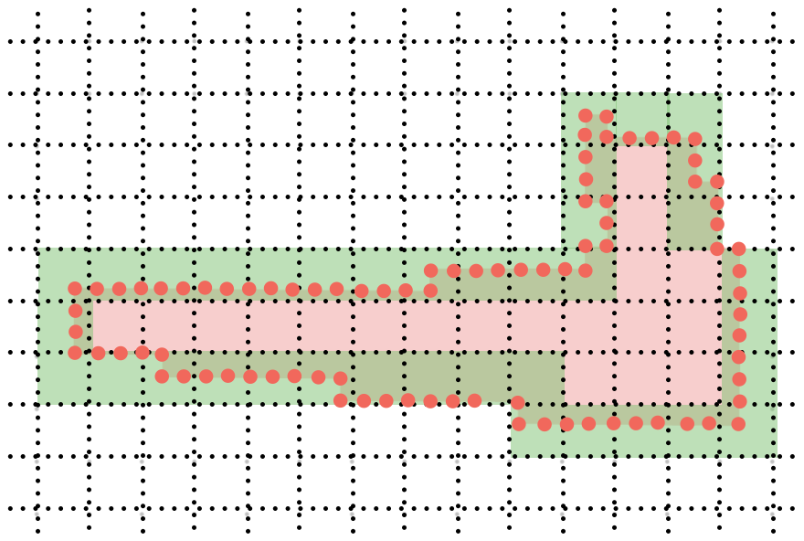

# fastfirespeed - Algorithm Explained
### Intro
We want to determine the maximum speed of a fire between two timesteps, t1 and t2. The fire perimeters are represented by multipolygons (sets of polygons). Let the perimeter at t1 be P1 and the perimeter at t2 be P2. One intuitive metric for the distance travelled by the fire is the maximum distance between P1 and P2. Simply, for each vertex in P2, we want to pair it with the nearest point in P1; then we want to find the longest of all these pairs. This concept is illustrated in the example below, taken from two timesteps of the East Troublesome Fire. The blue line shows the longest of these paths between the earlier timestep (darker) and the later timestep (lighter):


The naive way to compute this is to iterate over the outer polygon and then over the inner polygon, making O(n * m) comparisons for n points in P1 and m points in P2. This gets very expensive when working with big perimeters and many timesteps. We present a binning method to dramatically reduce the cost per step of computing these maximum spread vectors.

------------
Algorithm: BinnedFirespeed
    (inner_multipolygon, outer_multipolygon, matrix)
--------------------------
```
Iterate over outer_polygon in outer_multipolygon
    resample(outer_polygon)
    spot_check(outer_polygon, inner_multipolygon)
    if spot fire, compare with all inner polygons
    else, compare with only overlapping polygons
    Iterate over selected inner_polygon
        resample(inner_polygon)
        compute bounding_box for both polygons
        initialize bin_grid_inner over bounding_box
        initialize bin_grid_outer over bounding_box
        bin points in inner_polygon to bin_grid_inner
        add points in outer_polygon to bin_grid_outer
        compute inner_mask of occupied inner bins
        compute outer_mask of occupied outer bins
        initialize max_dist to -inf
        iterate over o_bin in outer_mask
            initialize ring = 0
            initialize unfound_flag = T
            while ring < max_ring
                compute list of occupied bins with linf-distance at most ring
                if list is not empty and unfound_flag is T
                        verify validity of combinations
                        set max_ring to ceil(sqrt(2)*ring) + slop
                        set unfound_flag = F
                if ring + 1 = max_ring and unfound_flag is F
                    save list of occupied bins to ib_list
                increment ring
            initialize temp_max_dist to -inf
            iterate over points p in o_bin
                initialize min_dist to inf
                iterate over inner_bin in ib_list
                    iterate over points q in inner_bin
                        compute dist(p, q)
                        save to min_dist if smaller
                save min_dist to temp_max_dist if greater
            save temp_max_dist to max_dist if greater
        save the minimum of these over all pairs including this outer polygon
    save the maximum over all outer polygons
return the distance and longest vector
```

------------
## Description

What is going on in the algorithm above? \
First, we need to iterate over all the polygons in the second timestep perimeter. We need to determine if they are spot fires (they do not overlap with the fire at the previous timestep). This will determine which polygons in the previous timestep we need to compare to. The algorithm finds the maximum distance over all desired pairs.

Second, we need to iterate over all the polygons in the first timestep perimeter. The algorithm finds the minimum distance computed over earlier timesteps with a fixed later timestep. Intuitively, the fire probably spread to place B from the nearest place A, but we want to find the longest of those A-B distances.

### Binned Nearest Neighbors

The meat of the algorithm: to compute longest distances efficiently over these combinations of polygons, we bin points on the perimeter, with a consistent grid between the first and second timestep. Again, we want to find the second-timestep point q with the maximum mininum distance to any first-timestep point p. 

 

Instead of directly comparing all points in the second timestep to all points in the first, we iterate over all occupied second-timestep bins $B_i$. The closest point $p$ to any $q_j \in B_i $ will naturally be in a nearby occupied bin $A_h$. 

To find nearest pairs to points in a fixed $B_i$, the algorithm works outward in rings of bins: first the 0th bin (the first-timestep bin in the same location), then the 1st ring bins with an L-inf distance of 1 from the initial bin, and so on. This is illustrated below, with the 0th bin in green, the 1st ring bins in light blue, and the 2nd-ring bins in darker blue. This system is easily implemented with array slicing. 

If an occupied bin $A_h$ is found in ring 2, the distance between $q$ and $p \in A_h$ could be between $1$ and $3\sqrt2$ bin widths. Generally, a point found is found in ring r, the distance to q will be between $r-1$ and $(r+1)\sqrt2$ bin widths. Therefore, if the first occupied bin is found in ring r, then a closer p may be found up to the $ \lceil (r+2) \sqrt2 \rceil + s$. Here, s is an integer "slop" parameter, explained below.


All elements $q_j \in B_i$ are then compared to all $p_k \in A_h$ for all $A_h$ with L-inf distance less than $ \lceil (r+2) \sqrt2 \rceil $. The shortest of these distances is saved for $q_j \in B_i$. The longest of these shortest-pairs is computed for each bin, and the longest overall pair is computed over all bins.

### Terrain Distance
To this point, distances between vertices have been discussed as though in 2d Euclidean space, but in actuality there is terrain between points. We compute distance over terrain by estimating the arc length over the terrain. Given a raster file and a step length, the algorithm samples along the vector from p to q and then computes distances from the sampling step length and the difference in elevation.

This presents a challenge for the binned nearest neighbors algorithm, since the terrain distance between points is no longer only a function of the start and end coordinates. This is accounted for by the addition of the slop distance s, to be determined by the user, to capture points further away by euclidean distance but (potentially) closer by terrain distance.